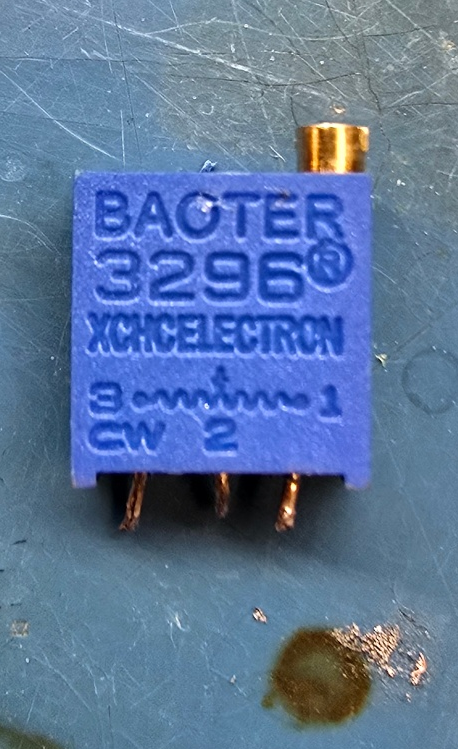

# Documentation

Welcome to the `ada-pusher` documentation.

## BOM

| Name | URL | Notes |
|------|-----|-------|
| ESP32 | The cheapest one you can find | `ESP32-WROOM-32D`, see notes below |
| L298N | [Amazon](https://www.amazon.com/dp/B0C5JCF5RS) | Motor driver/controller for linear actuator |
| LM2596 | [Amazon](https://www.amazon.com/dp/B0DBVYP91F) | Buck converter (15V -> 12V), suitable for motors and high power applications |
| Mini360 | [Amazon](https://www.amazon.com/dp/B08HQDSQZP) | Buck converter (15V -> 5V), suitable for low power applications such as the ESP32 board |
| USB-C PD Trigger Board | [Amazon](https://www.amazon.com/dp/B0CFTXRHLV) | Any trigger board should work, just make sure it supports 15V profile at minimum! |
| Suction cups | [Amazon](https://www.amazon.com/dp/B0DFLZ5FX4) | Other suction cups may need calibration, see notes below |

### Notes

- For the ESP32, if replacing, try to get one with the RISC-V architecture
  - Implementation `v1` uses `ESP32-WROOM-32D`, which is based on Xtensa, and while it works, there are some annoyances where you have to install a modified toolchain and LLVM compiler from Espressif.
  - Only get Xtensa-based boards if they are significantly cheaper than the RISC-V-based ones.
  - If you are working on `v2`+ and we have switched over to RISC-V-based ESP32 boards, please update this documentation and the main `README.md` of this repository and remove the custom toolchain/LLVM installation mention.
- For suction cups:
  - The Purdue Hackers office will stock replacements, should the existing suction cups on `ada-pusher` wear out. Please ask an organizer/officer if you notice the suction cups need replacing.
  - If the particular suction cups listed in the BOM become unavailable, you may source replacements if the nub portion of the suction cup is around 14.5mm in diameter.
  - If the particular suction cups listed in the BOM become unavailable, **and** the replacements have a different nub dimension:
    - Measure the nub diameter with a caliper.
    - Print out the `suction-cup-hole-calibration.FCStd` file in `../cad/` in this repository. You may need to export the model as a `.step` file.
    - Fit the new suction cup into the calibration and determine the correct hole diameter.
    - Open the `ada-pusher.FCStd` project file in `../cad/` in this repository. Open the spreadsheet.
    - Find the `Suction cup inner nub diameter` entry and change the value next to it. Wait while FreeCAD recalculates the model.
    - Export the new model as a `.step` file.
    - Print out the new model and verify fit.
    - Commit and push the new model to this repository (or make a pull request).

## Circuit

- Make sure to remove both jumpers from the `ENA` and `ENB` pins of the `L298N` driver.
- Adjust the potentiometer on the Mini360 until the output voltage is 5V when input is 15V.
- Adjust the potentiometer on the LM2596 until the output voltage is 12V when input is 15V.
- For the USB-C trigger board:
  - Most USB-C chargers/power adapters do not support the 12V profile, since the USB specification has deemed it optional. Therefore, we get 15V and drop it down to the required voltages, which is probably preferred as the power is more stable overall.
  - The particular board from Amazon comes with a tiny resistor between the 12V profile resistor and ground. You **must** remove this resistor, or else you may get a 9V output.
  - Solder the 15V profile resistor and the ground pad next to it together.
  - Verify 15V output when connected to a capable 15V USB-C PD source with a multimeter.
  - **Warning**: connecting a low-power USB-C PD source or a non-PD USB-C power source will result in the voltage dropping down to the highest voltage that the PD source can supply, which will usually be 5V or 9V. `ada-pusher` will not work with those voltages.
- For the Mini360:
  - The used chip (at least the one from Amazon) is the `MP1482DS`, and the [datasheet can be found here](https://www.monolithicpower.com/en/documentview/productdocument/index/version/2/document_type/Datasheet/lang/en/sku/MP1482/)
    - Funnily enough, the datasheet has a watermark saying the use is discouraged and to move over to the `MP1476`. Perhaps I have received old stock?
  - It may be worth removing the fiddly potentiometer and replacing it with a resistor.
    - The datasheet says Vout is determined by Vout = 0.923 * (R1 + R2) / R2
    - On the Mini360 board, R2 appears to be 8.2k Ohms (from the `822` marking on the resistor)
    - Thus, for Vout = 5V, R1 must be R1 = 5V * 8.2k Ohms / 0.923 - 8.2k Ohms = 36.2k Ohms
    - Update this section after testing, perhaps use 36.2k ~ 36.3k Ohm resistor
- For the LM2596:
  - Same thing as Mini360 where we replace the potentiometer with a resistor:
    - According to [the datasheet](https://www.ti.com/lit/ds/symlink/lm2596.pdf), Vout = 1.23 (1 + R2 / R1)
    - On the board, a trimpot ([3296 datasheet](https://www.bourns.com/pdfs/3296.pdf)) provides both R1 and R2.
      
    - After setting the trimpot to output 12V and desoldering it, the measurements are as follows:
      - Between pins 1 and 2: 2.38k Ohms
      - Between pins 2 and 3: 7.48k Ohms
      - Between pins 1 and 3 (total): 9.8k Ohms
    - Solder resistors such that both legs are in the center pin, and the other legs of the resistors go to each pin hole on either side. In the image, the right resistor is 2.4k Ohms, and the left resistor is 7.5k Ohms.
      
